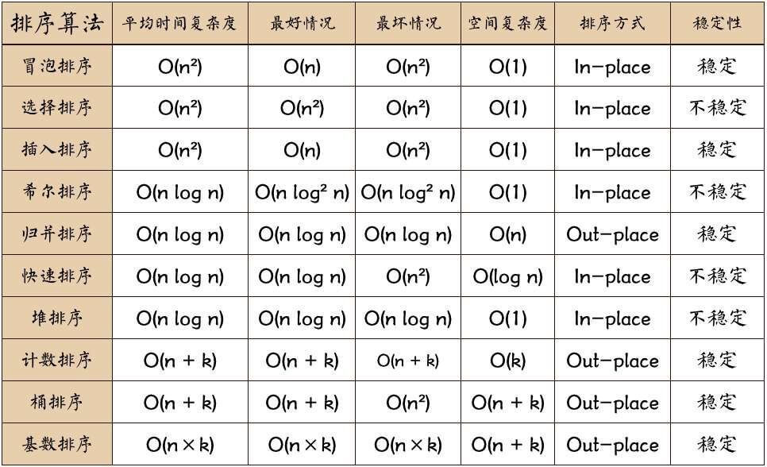

### 优质文章

[1 知乎 程序员必须掌握哪些算法](https://www.zhihu.com/question/23148377?utm_source=wechat_session&utm_medium=social&utm_oi=1175531418423312384)

[2 TreeMap红黑树源码详解](https://blog.csdn.net/abcdef314159/article/details/77193888)

---

### 排序

##### 概数
1、稳定排序：如果 a 原本在 b 的前面，且 a == b，排序之后 a 仍然在 b 的前面，则为稳定排序。

2、非稳定排序：如果 a 原本在 b 的前面，且 a == b，排序之后 a 可能不在 b 的前面，则为非稳定排序。

3、原地排序：原地排序就是指在排序过程中不申请多余的存储空间，只利用原来存储待排数据的存储空间进行比较和交换的数据排序。

4、非原地排序：需要利用额外的数组来辅助排序。

5、时间复杂度：一个算法执行所消耗的时间。

6、空间复杂度：运行完一个算法所需的内存大小。

---

##### 排序算法

选择排序 done

冒泡排序 done

插入排序 done

希尔排序 done

快速排序 done  
&emsp;&emsp;&emsp;&emsp;非递归式 done

堆排序 done

归并排序

&emsp;&emsp;&emsp;&emsp;非递归式 done

计数排序 done

桶排序 done

基数排序 done

### 算法技巧

>1.贪婪算法

>2.分治算法

>3.动态规划

>4.随机化算法

>5.回溯算法

### Tree

树的创建 done

树的创建 数组方式 done

树节点添加 done

树节点删除 done

树遍历（递归）done

树遍历（循环）done

层次遍历（循环）done

树的高度 done

树的节点 done

树的叶子节点 done

树集合生产器 done

搜索二插树 done

哈夫曼树

平衡树AVL done

红黑树  done

b树

b+树

堆树

深度：对于任意节点n,n的深度为从根到n的唯一路径长，根的深度为0；

高度：对于任意节点n,n的高度为从n到一片树叶的最长路径长，所有树叶的高度为0；
